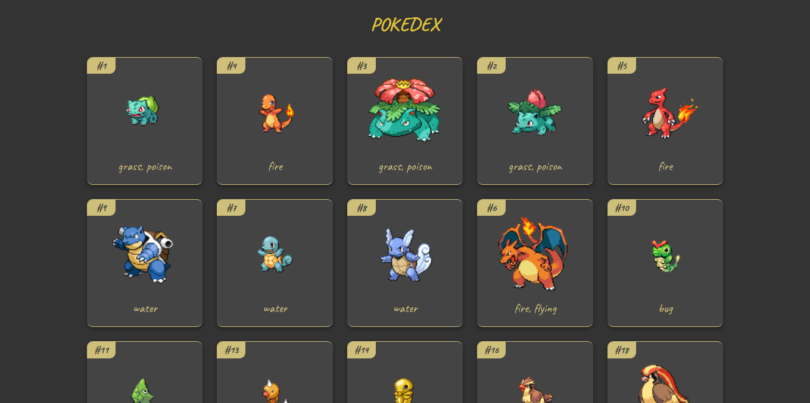

# POKEDEX

A Pokedex using TypeScript.

Available in: [https://bea-pokedex.netlify.app/](https://bea-pokedex.netlify.app/)

## References
[A Practical Guide to TypeScript - How to Build a Pokedex App Using HTML, CSS, and TypeScript by Ibrahima Ndaw](https://www-freecodecamp-org.cdn.ampproject.org/c/s/www.freecodecamp.org/news/a-practical-guide-to-typescript-how-to-build-a-pokedex-app-using-html-css-and-typescript/amp/)
